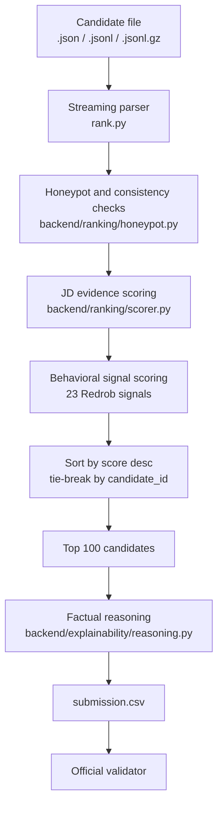

# BharatHire AI Ranker

BharatHire AI Ranker is an offline candidate discovery and ranking system built for the **Redrob India Runs Data & AI Challenge**. It reads the released candidate pool, removes implausible profiles, scores each candidate against the Senior AI Engineer JD, applies Redrob behavioral signals, and writes a validator-compliant top-100 CSV.

The official reproduction path is deterministic, CPU-only, network-free, and does not depend on hosted LLM APIs, GPUs, or model downloads during ranking.

## Hackathon Fit

The challenge is not to find candidates with the most AI keywords. The JD asks for a founding Senior AI Engineer who has shipped production retrieval, ranking, recommendation, evaluation, and ML systems, and who is realistically reachable by recruiters.

This project is designed around those constraints:

- Ranks only the top 100 candidates.
- Runs on CPU in under 5 minutes. The full 100k run completed locally in about 23 seconds.
- Uses no network calls during ranking.
- Produces the required CSV schema: `candidate_id,rank,score,reasoning`.
- Uses deterministic tie-breaking by rounded score, then `candidate_id`.
- Filters honeypots and impossible profiles before final ranking.
- Generates factual reasoning from candidate fields only.

## Repository Structure

```text
temp_workspace/
├── README.md
├── Dockerfile
├── requirements.txt
├── rank.py
├── app.py
├── submission.csv
├── submission_metadata.yaml
├── backend/
│   ├── parsing/
│   │   └── normalize.py
│   ├── ranking/
│   │   ├── honeypot.py
│   │   └── scorer.py
│   └── explainability/
│       └── reasoning.py
├── docs/
│   ├── pipeline_architecture.md
│   └── optimization_strategies.md
└── data/
    ├── candidates.jsonl
    └── sample_candidates.json
```

## Tech Stack

| Layer | Technology | Why Used |
| --- | --- | --- |
| Ranking CLI | Python 3.9+ standard library | Fast, reproducible, no network/model dependency |
| Data input | JSON, JSONL, JSONL.GZ | Supports the official bundle and local samples |
| Scoring | Rule-based evidence ranker | Defensible under interview and reliable under CPU constraints |
| Explainability | Deterministic factual templates | Avoids hallucinated reasoning and external LLM calls |
| Dashboard | Streamlit | Simple hosted sandbox/demo UI |
| Analytics UI | Pandas + Plotly | Tables and charts for inspecting top candidates |
| Packaging | Docker | Reproducible sandbox and demo environment |

`sentence-transformers` is intentionally not required for the default reproduction command. `rank.py --use-embeddings` exists as an optional local-only experiment path, but the official submission should use the deterministic default unless cached model artifacts are guaranteed offline.

## System Flow



## Architecture

### 1. Input Layer

`rank.py` accepts:

- `.jsonl`
- `.jsonl.gz`
- `.json`

The parser streams JSONL files line by line so the system does not need to load the full 100k pool into memory as one large object. Pretty JSON arrays are also supported for samples and demos.

### 2. Honeypot and Hard-Fit Filters

Implemented in `backend/ranking/honeypot.py`.

The code detects profiles that should not rank highly:

- expert or advanced skills with impossible zero-month usage patterns
- too many expert skills with very low aggregate usage
- job start dates before known company founding years
- end dates before start dates
- future start dates
- one job duration longer than the stated total experience
- summed job duration far beyond stated total experience
- substantial overlapping full-time job histories

This is important because the hackathon explicitly disqualifies submissions with too many honeypots in the top 100.

### 3. JD Evidence Scoring

Implemented in `backend/ranking/scorer.py`.

The scorer builds a local evidence text from:

- profile headline
- profile summary
- current title
- current company
- industry
- career history titles
- career history descriptions
- company names
- skills

It rewards evidence that maps to what the JD actually means:

- embeddings
- vector databases
- semantic search
- hybrid search
- BM25/OpenSearch/Elasticsearch/FAISS/Pinecone/Qdrant/Weaviate/Milvus
- ranking systems
- recommendation systems
- learning to rank
- LLMs and fine-tuning
- Python
- production deployment
- real users
- index refresh
- drift and regression handling
- latency and scale
- NDCG, MRR, MAP, benchmarks, A/B tests, and feedback loops

It penalizes:

- non-engineering profiles
- marketing/sales/recruiting keyword stuffing
- pure research-only profiles without production evidence
- only-consulting career history
- LangChain/LlamaIndex-only demo profiles without deeper retrieval/ranking evidence
- stale or unavailable candidates

### 4. Behavioral Signal Scoring

The ranker uses Redrob platform signals because the JD needs candidates who are reachable and likely to engage.

Signals used include:

- `profile_completeness_score`
- `last_active_date`
- `open_to_work_flag`
- `applications_submitted_30d`
- `recruiter_response_rate`
- `avg_response_time_hours`
- `skill_assessment_scores`
- `profile_views_received_30d`
- `saved_by_recruiters_30d`
- `search_appearance_30d`
- `connection_count`
- `endorsements_received`
- `notice_period_days`
- `preferred_work_mode`
- `willing_to_relocate`
- `github_activity_score`
- `interview_completion_rate`
- `offer_acceptance_rate`
- `verified_email`
- `verified_phone`
- `linkedin_connected`
- `expected_salary_range_inr_lpa`

The reason for using these signals is practical hiring fit. A technically perfect profile with a 5% response rate, old activity, and a long notice period is less valuable than a strong candidate who is active, responsive, open to work, and available quickly.

### 5. Sorting and Output

The final ranking sorts candidates by:

1. rounded score descending
2. `candidate_id` ascending for deterministic tie-breaking

The output file contains:

```csv
candidate_id,rank,score,reasoning
```

Only the top 100 candidates are written for the official submission.

### 6. Reasoning Generation

Implemented in `backend/explainability/reasoning.py`.

Reasoning is generated from facts in the candidate JSON:

- current title
- years of experience
- companies
- exact skill names
- retrieval/ranking/production evidence
- recruiter response rate
- notice period
- last active date
- obvious concerns

This avoids hallucination and supports the Stage 4 manual review requirement.

## How To Run

### Install

```bash
cd BharatHire-Ranker
pip install -r requirements.txt
```

### Generate The Submission CSV

```bash
python3 rank.py --candidates ./data/candidates.jsonl --out ./submission.csv
```

For the official gzipped file:

```bash
python3 rank.py --candidates ./data/candidates.jsonl.gz --out ./submission.csv
```

For a small sample:

```bash
python3 rank.py --candidates ./data/sample_candidates.json --out ./sample_submission.csv
```

### Validate

Use the official validator from the hackathon bundle:

```bash
python3 validate_submission.py submission.csv
```

Expected result:

```text
Submission is valid.
```

## Dockerization

The Dockerfile packages the Streamlit sandbox/demo.

### Build

```bash
docker build -t bharathire-ranker .
```

### Run Dashboard

```bash
docker run -p 8501:8501 bharathire-ranker
```

Open:

```text
http://localhost:8501
```

### Run CLI In Docker

Mount your local data and output folders:

```bash
docker run --rm \
  -v $(pwd)/data:/app/data \
  -v $(pwd):/app/out \
  bharathire-ranker \
  python3 rank.py --candidates /app/data/candidates.jsonl --out /app/out/submission.csv
```

### Docker Design

- Base image: `python:3.9-slim`
- No GPU dependencies.
- No model downloads required.
- Installs only lightweight runtime dependencies from `requirements.txt`.
- Default command launches the Streamlit dashboard.
- Healthcheck uses Python `urllib`, so no extra `curl` package is needed.

## Streamlit Demo

Run locally:

```bash
streamlit run app.py
```

The dashboard lets reviewers:

- upload a JSONL/JSON candidate sample
- tune scoring weights
- see top candidates
- view score distribution
- inspect experience vs score
- inspect top skills
- download a CSV

This is useful for the required sandbox/demo link. The official scoring CSV should still be generated with `rank.py`.

## Files To Change Before Final Submission

Update `submission_metadata.yaml` before uploading:

- `team_name`
- `primary_contact.name`
- `primary_contact.email`
- `primary_contact.phone`
- `team_members`
- `github_repo`
- `sandbox_link`
- `compute` details if they differ from your machine
- `ai_tools_used`
- `ai_usage_summary`

Also rename the final CSV if the portal requires your registered participant ID as the filename.

## Verification Already Performed

On this workspace:

- Full 100k ranking completed in about 23 seconds.
- `submission.csv` passed the official validator.
- Top 100 contained 0 locally detected honeypots.
- Sample input run completed successfully.

## Why This Approach Is Defensible

The JD explicitly says the right answer is not keyword matching. This ranker still uses lexical evidence, but it uses it in context: job descriptions, production language, evaluation language, career history, product experience, and behavioral availability all affect the final score.

That makes the system easy to explain in an interview:

- It is fast enough for the compute budget.
- It is reproducible offline.
- It avoids LLM/API dependency risk.
- It handles honeypots directly.
- It gives factual, auditable reasons for every selected candidate.
