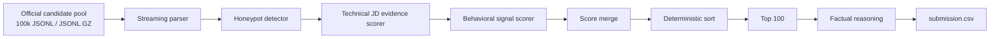

# Pipeline Architecture - BharatHire AI Ranker

This document explains the final ranking architecture used for the Redrob India Runs Data & AI Challenge.

The goal is to produce a high-quality top-100 candidate list under the official constraints:

- CPU only
- no network during ranking
- no hosted LLM APIs
- under 5 minutes wall-clock
- top-100 CSV only
- factual reasoning
- low honeypot risk

## High-Level Flow

## Why A Deterministic Ranker

The challenge has hidden judging and strict reproduction. A model-heavy or API-heavy approach creates avoidable risk:

- hosted APIs are not allowed during ranking
- downloaded model weights may not exist in the judge sandbox
- CPU embedding inference can be slower and harder to reproduce
- LLM-generated reasoning can hallucinate candidate facts

The final default ranker therefore uses deterministic local scoring. This makes the result:

- fast
- auditable
- explainable
- easy to defend in an interview
- reproducible in Docker or a clean Python environment

## Main Modules

| Module | Responsibility |
| --- | --- |
| `rank.py` | CLI entrypoint, input parsing, final sorting, CSV writing |
| `backend/parsing/normalize.py` | Skill aliases and canonical skill matching |
| `backend/ranking/honeypot.py` | Impossible profile and trap detection |
| `backend/ranking/scorer.py` | JD evidence scoring and behavioral signal scoring |
| `backend/explainability/reasoning.py` | Factual 1-2 sentence reasoning generation |
| `app.py` | Streamlit demo UI for sample ranking and analysis |

## Input Handling

`rank.py` accepts three input formats:

- `.jsonl`
- `.jsonl.gz`
- `.json`

JSONL and JSONL.GZ files are streamed line by line. This keeps memory usage low and lets the full candidate pool be processed quickly.

## Stage 1: Honeypot And Consistency Detection

The honeypot detector is intentionally conservative. It only flags profiles with strong evidence of inconsistency.

Checks include:

- 8 or more advanced/expert skills with zero duration
- 10 or more expert skills with implausibly low total duration
- job duration longer than stated total experience
- summed job duration far beyond stated total experience
- end date before start date
- future start date
- work before known company founding year
- substantial overlapping employment periods

Reason:

The official spec warns that honeypots are forced to relevance tier 0 and can disqualify a submission if too many appear in the top 100.

## Stage 2: Technical JD Evidence Scoring

The scorer converts each profile into a local evidence text from:

- headline
- summary
- current title
- company
- industry
- career history titles
- career history descriptions
- skills

The scorer rewards the JD's real requirements:

- retrieval systems
- vector search
- vector databases
- hybrid search
- BM25
- OpenSearch / Elasticsearch
- FAISS / Pinecone / Qdrant / Weaviate / Milvus
- embeddings
- ranking systems
- recommendation systems
- learning to rank
- LLMs
- fine-tuning
- Python
- ranking evaluation
- production deployment

This is stronger than skill-section keyword counting because the JD says career history can reveal strong candidates even when they do not use fashionable AI terms.

## Stage 3: Production And Evaluation Evidence

The ranker separately rewards production-quality language:

- deployed
- real users
- shipped
- scale
- latency
- on-call
- index refresh
- drift
- regression
- pipeline ownership

It also rewards ranking evaluation evidence:

- NDCG
- MRR
- MAP
- A/B tests
- offline evaluation
- benchmarks
- feedback loops

Reason:

The JD asks for someone who can build and evaluate ranking systems, not just use AI frameworks.

## Stage 4: Behavioral Signal Integration

The scorer uses Redrob's behavioral signals as availability and hiring-likelihood modifiers.

Strong positive signals:

- high recruiter response rate
- fast average response time
- recent activity
- open to work
- short notice period
- willingness to relocate
- hybrid/flexible work mode
- strong GitHub activity
- high skill assessment scores
- recruiter saves and profile views
- strong interview completion
- strong offer acceptance
- verified email and phone
- LinkedIn connected

Negative signals:

- stale activity
- very low recruiter response rate
- very slow response time
- long notice period
- low interview completion
- unrealistic salary expectation

Reason:

A perfect technical profile is not valuable if the candidate is unreachable or unavailable.

## Stage 5: Penalties

The ranker penalizes candidates who look like poor JD fits:

- non-engineering titles
- marketing, sales, recruiting, or design profiles with AI keywords
- pure research profiles without production evidence
- only-consulting career history
- shallow LangChain/LlamaIndex demo-only profiles
- too little experience
- overly senior or unrelated profiles

Reason:

The JD explicitly warns against keyword stuffing, pure research-only candidates, consulting-only backgrounds, and framework enthusiasts.

## Stage 6: Final Ranking

The final candidate list is sorted by:

1. rounded score descending
2. `candidate_id` ascending for equal rounded scores

Only the top 100 are written.

## Stage 7: Reasoning

The reasoning generator uses only candidate JSON facts:

- title
- years of experience
- employers
- exact skills
- retrieval/ranking/production evidence
- response rate
- notice period
- last active date
- concerns, when present

It avoids:

- invented skills
- invented employers
- invented project names
- LLM-generated claims
- identical reasoning strings

## Optional Embedding Mode

`rank.py --use-embeddings` can add local `sentence-transformers` scoring if installed and cached.

This is not the official default because:

- it adds dependency and artifact risk
- it may try to download weights in a clean environment
- deterministic scoring already satisfies the reproduction constraints

Use it only for local experimentation or if the model artifact is explicitly available offline.

## Runtime Characteristics

The final full run in this workspace:

- input size: 100k candidates
- runtime: about 23 seconds
- output rows: 100
- locally detected honeypots in top 100: 0
- validator result: valid

## Architecture Tradeoff

This solution chooses reproducibility and defensibility over black-box model complexity. That is appropriate for this challenge because Stage 3 and Stage 5 require the team to reproduce and explain the system under strict constraints.
